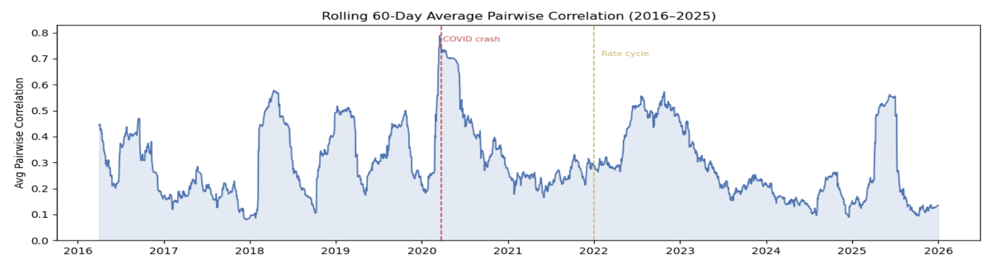
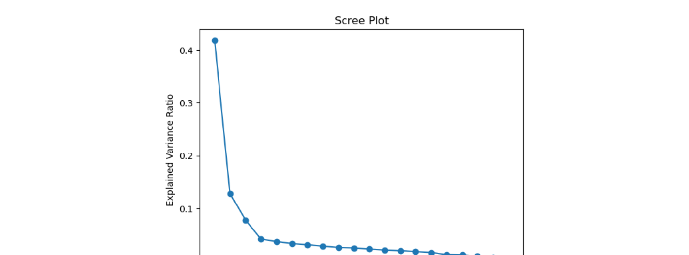
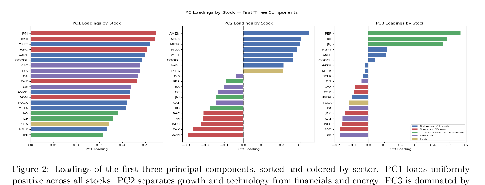
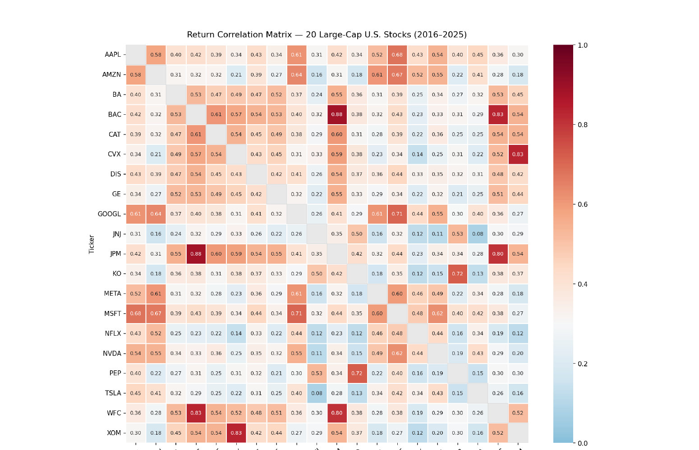
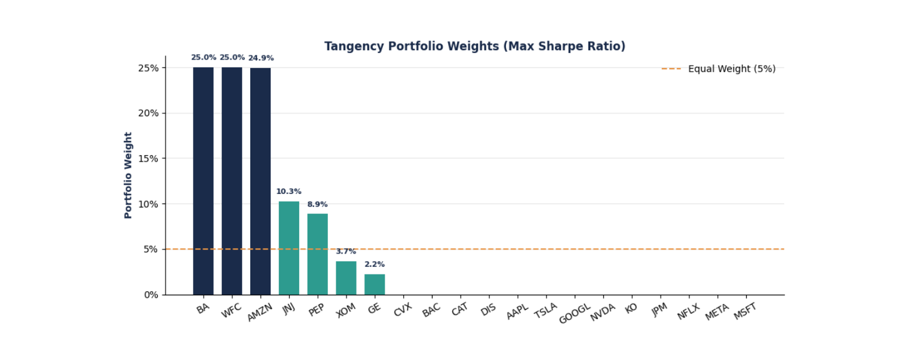
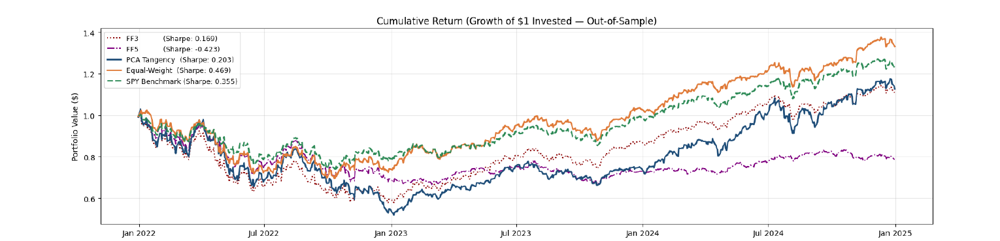
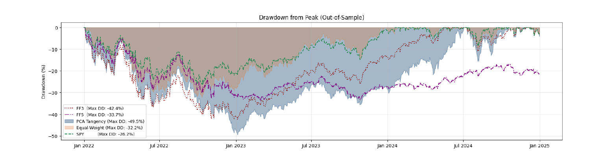
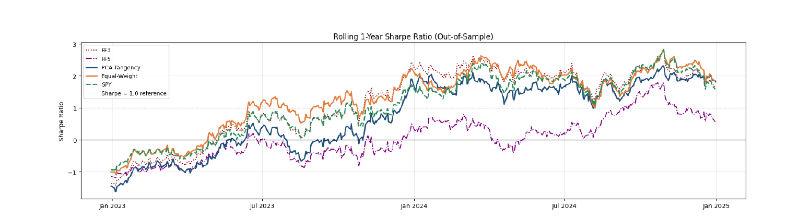
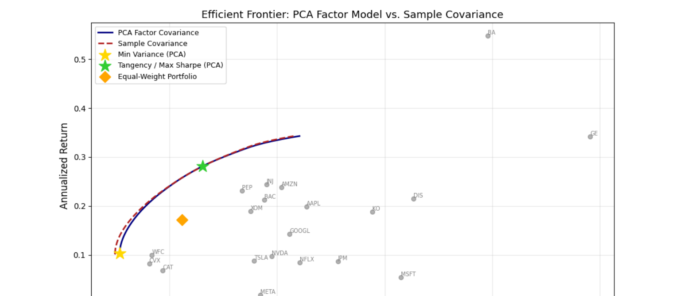
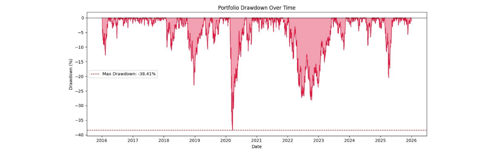

# PCA on Stock Returns and Economic Interpretation

**Does the Fama-French factor structure emerge naturally from raw price data — with no economic labels imposed?**

This project applies Principal Component Analysis to 10 years of daily returns for 20 large-cap U.S. stocks (2016–2025) and asks whether the latent factors PCA extracts line up with the market, value/growth, and profitability/investment dimensions that Fama-French theory predicts. It then tests whether that structure translates into better portfolios out-of-sample.

> STATS 5261 Final Project — Group 9

---

## TL;DR

- **PC1 is a pure market factor.** It loads positively on all 20 stocks and correlates 0.958 with the Fama-French market factor (adjusted R² = 0.946–0.948).
- **PC2 is value-vs-growth.** Growth/tech stocks load positively, financials/energy load negatively; PC2 correlates −0.804 with HML.
- **PC3 is a profitability/investment dimension**, dominated by defensive consumer staples and healthcare names — the FF5 extension (RMW, CMA) roughly doubles its explanatory power over FF3.
- **Statistical elegance ≠ better portfolios.** The PCA-based tangency portfolio looks best in-sample (Sharpe 1.12) but is the worst out-of-sample performer, with the deepest drawdown (−49.5%). The naive equal-weight portfolio wins out-of-sample.
- **The factor structure isn't stable.** Between 2016–2022 and 2023–2025, the market factor (PC1) weakens as NVIDIA's idiosyncratic AI-driven return increasingly dominates the cross-section.

---

## Motivation

During major market events — the COVID-19 crash, the 2022 rate-hike cycle — individual stock returns stop looking independent and start moving together. That co-movement suggests a low-dimensional structure underneath 20 seemingly separate return series. Financial economics already has a name for this structure: the Fama-French factor model (market, size, value, and — in the five-factor extension — profitability and investment). This project asks a narrower, more falsifiable question: **if you hand PCA nothing but a return matrix, does it rediscover that same structure on its own?**

## Data & Methodology

- **Universe:** 20 large-cap U.S. stocks spanning tech, financials, energy, industrials, and consumer staples/healthcare, 2016–2025 daily data (via `yfinance` / Kaggle S&P 500 price history).
- **Returns:** log-returns $r_{i,t} = \log(P_{i,t}/P_{i,t-1})$, standardized to $z_{i,t} = (r_{i,t} - \bar r_i)/s_i$ before PCA.
- **PCA:** eigendecomposition of the standardized-return correlation matrix, $\Sigma = V\Lambda V^\top$; explained variance ratio of component $k$ is $\lambda_k / \sum_j \lambda_j$.
- **Interpretation:** stock-level loadings, an Apple case-study regression on PC1/PC2, and validation regressions of each PC onto the Fama-French three- and five-factor models.
- **Portfolio construction:** mean-variance tangency portfolios (25% per-stock cap) built from the PCA factor covariance and from FF3/FF5 covariances, benchmarked out-of-sample against SPY and an equal-weight portfolio via a rolling walk-forward backtest (5-year training window, annual re-estimation).
- **Robustness check:** the full sample is split into 2016–2022 vs. 2023–2025 to test whether the factor structure held up through NVIDIA's rise.

## Key Results

### 1. A small number of factors explains most of the co-movement

Average pairwise correlation across the 20-stock universe sits around 0.2–0.3 in calm periods but spikes above 0.75 during the COVID-19 crash and stays elevated through the 2022 rate cycle — direct evidence that returns are not independent.



*Rolling 60-day average pairwise correlation, 2016–2025. Correlation spikes sharply during COVID-19 and remains elevated through the 2022 rate cycle.*

The first five principal components explain **~70.4%** of total variance (41.9% / 12.8% / 7.8% / 4.2% / 3.7% for PC1–PC5), and the scree plot flattens sharply after that.



### 2. The components have clean economic readings



*PC1 loads positively on every stock (a pure market factor). PC2 splits growth/tech (positive) from financials/energy (negative). PC3 is dominated by consumer staples and healthcare — a defensive/quality dimension.*

Regressing Apple's daily returns on PC1 and PC2 alone gives **R² = 0.629** (t-stats of 59.1 and 27.7, F = 2,127) — evidence the factors carry explanatory power at the individual-stock level, not just in aggregate.

### 3. Fama-French validation confirms the interpretation

| PC  | FF3 Adj. R² | FF5 Adj. R² | Δ (FF5 − FF3) |
|-----|:-----------:|:-----------:|:--------------:|
| PC1 | 0.946       | 0.948       | +0.002          |
| PC2 | 0.650       | 0.675       | +0.025          |
| PC3 | 0.145       | 0.226       | +0.081          |
| PC4 | 0.005       | 0.036       | +0.032          |
| PC5 | 0.021       | 0.028       | +0.007          |

PC1 is almost entirely the market factor (t = 205.6 on Mkt-RF). PC2 is explained by HML (t = −67.4, raw correlation −0.804). PC3 sees the largest jump from FF3→FF5, picking up RMW (t = 14.1) and CMA (t = 10.0) — a profitability/investment signature. PC4 and PC5 (R² < 0.04) look like residual, idiosyncratic noise rather than systematic risk.



*Pairwise return correlation matrix — within-sector clustering is visible for financials (ρ > 0.80) and technology.*

### 4. Statistical structure doesn't guarantee portfolio outperformance

The PCA tangency portfolio is highly concentrated even under a 25% per-stock cap (13 of 20 stocks get zero weight):



In a rolling walk-forward backtest, that concentration hurts: the **equal-weight portfolio has the highest out-of-sample Sharpe ratio**, followed by SPY, while the PCA, FF3, and FF5 tangency portfolios all underperform. PCA tangency also suffers the deepest drawdown (−49.5% vs. SPY's −26.2%).







In-sample, the picture looks very different — the PCA tangency portfolio dominates the frontier (Sharpe 1.124 vs. 0.706 equal-weight):



| Portfolio | Annual Return | Annual Vol | Sharpe |
|---|:---:|:---:|:---:|
| MVP (PCA Frontier) | 10.3% | 15.4% | 0.528 |
| Tangency (PCA Frontier) | 28.2% | 23.1% | 1.124 |
| Equal-Weight Benchmark | 17.1% | 21.2% | 0.706 |

The gap between the in-sample frontier and the out-of-sample backtest is the point: mean-variance optimization is highly sensitive to estimation error, and equal-weighting sidesteps that fragility entirely.



### 5. The factor structure isn't static — NVIDIA is a big part of the recent story

Splitting the sample into 2016–2022 and 2023–2025:

| Metric | 2016–2022 | 2023–2025 |
|---|:---:|:---:|
| Annual Return (equal-weight) | 12.7% | 27.6% |
| Annual Volatility | 22.4% | 16.2% |
| Sharpe Ratio | 0.57 | 1.70 |
| Max Drawdown | −41.2% | −20.9% |
| NVDA Annualized Return | 41.7% | 85.4% |
| NVDA PC1 Loading | 0.213 | 0.230 |
| PC1 Explained Variance | 45.9% | 31.4% |

Risk-adjusted performance nearly tripled in the recent period, but PC1 itself explains *less* variance in 2023–2025 — the broad market factor weakened as NVIDIA's idiosyncratic, AI-driven performance became a larger share of the cross-section. The growth-vs-value reading of PC2 increasingly looks like an NVIDIA story specifically, which is a caveat worth carrying forward rather than treating the factor structure as fixed.

## Conclusion

PCA recovers, without any prior economic labels, the same factor structure decades of asset-pricing research assigns to market risk, value/growth rotation, and profitability/investment. That's a genuine validation of the Fama-French framework from the data side. But recovering the right *risk* structure is not the same as building a better *portfolio*: the PCA tangency portfolio's in-sample Sharpe advantage evaporates out-of-sample, undone by estimation error and concentration risk that a naive equal-weight strategy avoids. And the structure itself drifts — the 2023–2025 subperiod shows the market factor weakening as single-stock (NVIDIA) risk becomes more prominent, a reminder that PCA-based factor interpretations should be revisited as market regimes change rather than treated as fixed.

## Repository Structure

```
.
├── README.md
├── requirements.txt
├── Final_Proj_Code.ipynb      # full analysis: EDA → PCA → regression → FF validation → optimization → backtest
├── STATS_5261_Project (1).pdf # write-up this README is based on
└── fig*.png                   # figures used in this README
```

## Running the Notebook

```bash
pip install -r requirements.txt
jupyter notebook Final_Proj_Code.ipynb
```

The notebook downloads price history via `kagglehub` (S&P 500 stock prices dataset) and `yfinance`, so an internet connection is required on first run.

## Notebook Sections

1. **Stock Universe EDA** — skewness/kurtosis, historical VaR, drawdown
2. **20-Stock PCA** — correlation matrix, eigendecomposition, scree plot, loadings
3. **Apple Regression Model** — PC1/PC2 as explanatory factors for a single stock
4. **Fama-French Validation** — FF3 and FF5 regressions on each principal component
5. **Portfolio Optimization via PCA Factor Model** — factor covariance, efficient frontier, tangency portfolio
6. **Backtesting Against SPY** — rolling walk-forward comparison of PCA / FF3 / FF5 / equal-weight / SPY
7. **Subperiod Analysis** — 2016–2022 vs. 2023–2025, isolating NVIDIA's contribution

## Authors

Group 9 — STATS 5261, Columbia University
